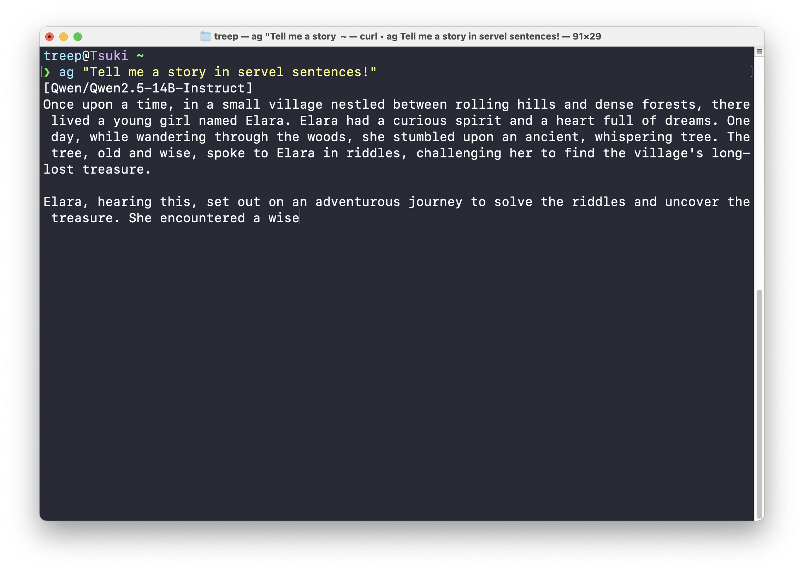

# CLI-LLM-Agent

A command-line LLM client that works on any terminal!

It's a lightweight Bash script that is easy to deploy and supports stream output.

------

使用 Bash shell 编写的一个命令行界面的大语言模型客户端，可以让你在任何终端中询问 AI！支持流式输出并且极易部署。（~~想法来自 jyy 老师在课中演示的 AI Agent~~）



## Quick Start

1. Install `jq`  with your package manager like `homebrew`, `apt`, or `dnf`.
2. Copy `ag.sh` to your computer (preferably to to a directory included in your `PATH` ).

3. Open this shell in an editor, and modify the following variables according to your model API: `api_url`, `model`, and `api_key`. 

   An example shows below (for reference only, **not** to use):

```bash
# Modify following configurations manually
api_url="https://api.siliconflow.cn/v1/chat/completions"
model="Qwen/Qwen2.5-14B-Instruct"
api_key="sk-abcdefghijklmnopqrstuvwxyz"
```

4. Just use it now in one of following approaches:

```bash
$ ag [prompt]
```

```bash
$ ag
[User] <Input long prompts here>
```

------

1. 使用包管理器安装 `jq`（如果系统里没有的话）。

2. 复制 `ag.sh` 到电脑里，推荐添加到 `PATH` 环境变量中。

3. 根据你的模型 API，用编辑器编辑 `ag.sh` 修改文件开头的的三个变量：`api_url`，`model` 和 `api_key`。

示例如下（仅供参考，不要使用）：

```bash
# Modify following configurations manually
api_url="https://api.siliconflow.cn/v1/chat/completions"
model="Qwen/Qwen2.5-14B-Instruct"
api_key="sk-abcdefghijklmnopqrstuvwxyz"
```

4. 部署完成，现在你可以参照以下方式使用此脚本：

```bash
$ ag [提示词]
```

```bash
$ ag
[User] <此处支持输入长提示词>
```

